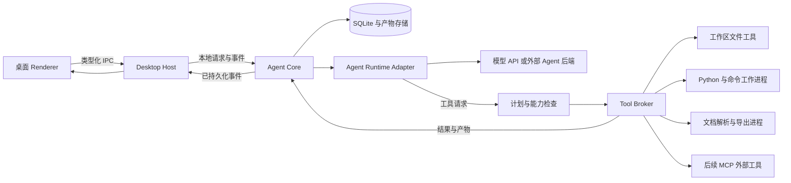
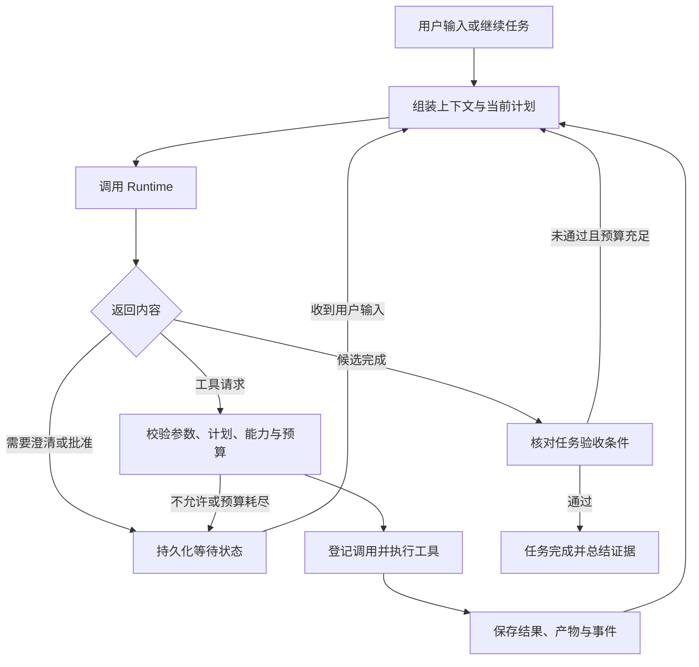

# 系统架构

状态：v0.1 技术提案。采用本地模块化核心和独立工作进程，不将模块边界全部转化为服务边界。

## 1. 进程拓扑



Renderer 只负责展示和用户输入。Desktop Host 负责窗口、文件选择、系统凭证、IPC 和 Core 生命周期。Core 负责领域状态、任务调度、策略、工具编排及持久化。模型调用、解析和计算不得阻塞 UI。

建议 Electron 的 Renderer 关闭 Node 集成，启用 context isolation；preload 只暴露逐项列出的 IPC 方法，不暴露任意命令、任意文件读取或密钥。这些是 NEXIOM 的实施要求，不是对 Codex 技术栈的断言。

## 2. 技术选择和依赖方向

| 层 | 建议 | 选择依据 |
| --- | --- | --- |
| 桌面 | Electron、React、TypeScript | 适合多面板、代码差异、终端和流式事件；代价是内存和安装体积 |
| 本地核心 | TypeScript 独立进程 | 共享协议类型；与桌面渲染故障隔离 |
| 计算 | 项目固定 Python 环境，进程级运行 | 使用现有 NumPy/pandas/SciPy 等生态；按问题安装必要依赖 |
| 数据 | SQLite WAL、不可变文件存储 | 支持事务、查询、事件游标和备份；无需本地数据库服务 |
| 文档 | 解析器适配器、Markdown/LaTeX 中间来源、固定模板渲染 | 解析失败和排版失败可独立定位；具体导出工具在 P0 验证 |
| 凭证 | OS 凭证库，由 Host 代理调用 | 项目文件、日志及导出包不包含 API Key |

依赖方向为 UI -> 应用命令 -> 领域服务 -> 接口 -> 基础设施。领域结构不依赖 Electron、某家模型 SDK 或 Python 库。采用普通模块与依赖注入即可，暂不引入通用工作流引擎。

## 3. Runtime 路线的决策门槛

NEXIOM 必须拥有项目、任务、计划、实验、证据和文件版本。推理循环有两条候选实现，P0 只选一条进入首版：

| 路线 | 收益 | 必须先证明的条件 |
| --- | --- | --- |
| 直接模型 API + NEXIOM 循环 | 工具权限、领域流程和模型接入可控 | 能可靠完成流式响应、工具调用、上下文压缩、取消及恢复；团队能维护运行循环 |
| 现成 Agent 后端适配 | 可复用其上下文与通用开发能力 | 官方支持的认证和集成方式可用；能够控制工具执行、获得结构化事件并追踪产物 |

现成后端若不能把写入和执行纳入 NEXIOM 权限检查，不能以“兼容”名义绕过 Tool Broker；只能采用明确的受限能力，或者不选该路线。若后端自行拥有工具循环，NEXIOM 不再在外层执行第二套模型循环。

默认工程建议是直接 API 路线，但模型提供商、SDK 与计费方式未定。Codex App Server 只是待验证候选，不能假定用户桌面登录可直接复用。适配接口见模块文档。

## 4. 运行循环与停止条件



每次提交都进入统一任务循环。Agent 根据目标在当前项目内讨论、读取、解析、写入并运行工具，不再等待模式切换或执行确认；路径、联网设置、取消信号和资源边界仍在每次调用前校验。

循环每一步检查取消信号、计划版本及预算。每次失败记录原因；只重试被声明为可重试的错误。初始建议：相同工具与相同输入连续失败 2 次后停止原样重试，允许至多 2 轮有解释的修复；仍失败则进入等待用户状态。策略可配置，不能无限循环。

工具成功仅表示一次动作成功，Agent Run 成功表示本轮处理结束，Task 完成需要任务验收通过，Experiment 成功需要输出契约检查通过。四者不能混用。

## 5. 上下文管理

每次模型请求依次包含：系统规则和工具协议、用户最新指令、任务及依赖状态、已确认的建模假设、相关文件或来源片段、近期工具结果。提供商专用字段仅存于适配器。

大文件、完整日志、历史图表保存为资源引用，按需抽取；工具响应限制体积并返回完整结果位置。压缩历史时保存 ContextSnapshot，记录原事件范围及引用，保留未解决问题和用户约束。摘要是派生内容，不能替代来源或成为新的权限来源。

项目知识先使用结构化索引、文件搜索及 SQLite 全文检索。只有检索评测证明不足时才引入向量检索。技能提供领域步骤、适用条件及验证要求，不能自行授予权限。

## 6. 持久化、快照与恢复

每个项目包含一份 `.nexiom/state.sqlite`，Core 是唯一写入者。状态表是当前状态权威；事件表提供可恢复 UI 和审计轨迹。一次状态转换与相应事件在同一 SQLite 事务提交。此设计不要求通过历史事件重建全部业务状态。

工作文件可编辑；已登记的文件版本、数据版本、代码快照和产物按内容哈希保存，不能原地修改。文件先写临时位置并校验后原子转入不可变存储，再提交数据库引用；崩溃遗留的未引用文件由后续清理处理。数据库引用缺失文件时明确报告损坏。

实验在 `runs/<experiment-id>/` 使用固定输入运行，输出验证后才登记为产物。草稿或代码修改采用带基础哈希的补丁；基础内容已变化则产生冲突，不直接覆盖用户编辑。外部编辑需要导入为新版本，并使依赖旧版本的检查显示过期。

UI 可从 `afterSequence` 重连读取事件。普通事件按项目序号排序；token/日志流按块持久化并限速，不按每个 token 写一条事务。用户确认或工具调度必须先落库再对 UI 确认。

重启时扫描未结束调用与进程记录：可证明仍运行且属于本项目的工作进程才可重新连接，否则将结果标为未知并进行检查。读取可重新执行；具有副作用的调用不得因超时或丢失响应而自动重放。恢复创建新的 AgentRun，并关联原运行，保留完整历史。

首版应用退出时终止本地工作进程并持久化状态，不承诺关闭应用后继续计算。后台运行需后续增加独立服务生命周期。

## 7. 并发和用户干预

一个项目允许多个会话，但首版同时只有一个拥有研究工作区写权限的执行 Run。每项目一把执行租约；用户打开第二窗口时附着同一 Core，无法协调则只读打开。不能靠 SQLite WAL 代替进程级所有权。

计划内的独立实验可在各自目录限量并行，默认 1 个。文件修改、数据库更新及成果发布依旧由 Core 仲裁。暂停在工具边界生效；取消立即发信号、在宽限期后终止整个子进程树。Windows 进程控制需要验证 Job Object 或等价机制，不能仅杀父进程。

新用户消息在下一次模型决策前进入上下文。取消应尽快终止后续动作，但已有文件修改或外部副作用不能通过取消追溯撤回。

## 8. 执行环境和信任边界

API Key 不传入任意 shell/计算环境；使用明确的环境变量白名单。附件、网页、MCP 输出和模型生成代码都是内容或待执行程序，不能修改系统规则与授权。

路径检查需处理 Windows 大小写、符号链接、junction、UNC 路径和真实路径，不用字符串前缀判断目录归属。压缩包导入限制展开大小并拒绝路径穿越。文档预览隔离活动内容与外部资源。

进程隔离、虚拟环境和工作目录约束都不等于 OS 沙箱。任意 Python 或 shell 以用户权限执行时仍可能访问其他文件或网络，必须如实标为“本机受信任执行”。

P0/P1 区分两种能力：受策略限制的内置文件工具；需要受信任执行授权的通用程序。若产品承诺阻止任意程序越界或联网，应先选定并验证容器、VM 或 OS 沙箱，再提供该权限模式。后端没有实际网络隔离能力时，不能宣称已禁止子进程网络访问。

## 9. 项目布局建议

```text
project/
  inputs/                 原始赛题和数据副本
  work/                   可编辑代码、处理后的数据、研究笔记
  runs/<experiment-id>/   单次实验目录与日志
  paper/                  论文来源与模板配置
  exports/                用户选择导出的交付物
  .nexiom/
    project.json          projectId、schemaVersion 等可读清单
    state.sqlite          会话、计划、实验、引用、事件
    objects/sha256/        不可变文件内容
    cache/                可重建解析及预览缓存
```

全局设置和凭证引用保存在应用用户目录。项目迁移用相对路径和 projectId 重建绑定，密钥不随项目迁移。备份用 SQLite 一致性备份机制或关闭数据库后复制，不能在 WAL 活跃时只复制主数据库文件。
