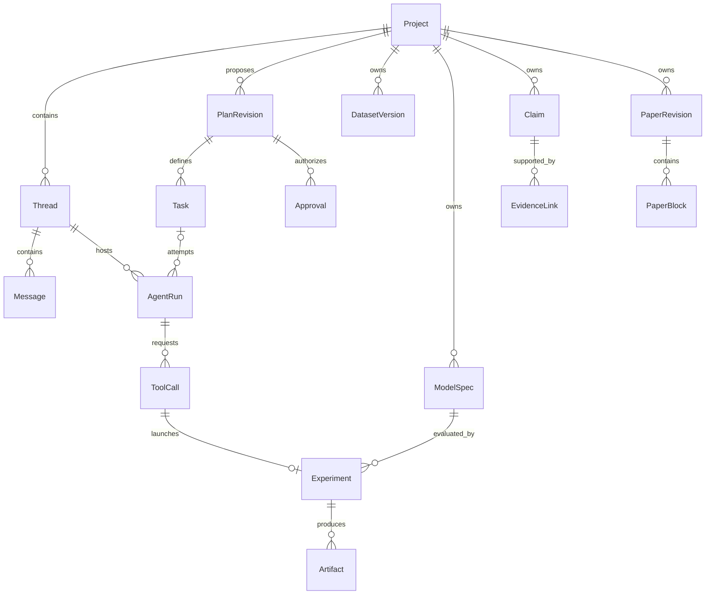

# 核心数据结构

状态：v0.1 逻辑模型。字段名是待实现契约；本轮不创建迁移或运行代码。

## 1. 统一约定

实体使用应用生成的全局唯一 ID；时间以 UTC 保存、按用户时区展示；项目内路径为相对路径，文件内容使用 SHA-256 标识。记录包含 schemaVersion，可编辑聚合使用递增 revision 做乐观并发控制。

明确区分四层：Thread 是讨论空间，Task 是待完成目标，AgentRun 是一次 Agent 执行尝试，Experiment 是一次固定输入的计算。一个任务可以跨多次对话和多个 Run，一次 Run 可以启动多个 Experiment。

核心关系由外键和连接表表达。定义上属于一个项目的记录不得引用另一个项目的对象，导入项目时显式处理引用映射。字段中的 `?` 表示可空，列表在数据库中可用连接表保存。

## 2. 领域关系

图中省略多对多连接表：实验与数据版本、论文块与论断、任务依赖、产物输入以及来源定位。实际迁移以字段表和不变量为准。

## 3. 项目、交互与执行

| 实体 | 核心字段 | 不变量 |
| --- | --- | --- |
| Project | id, name, rootBinding, competitionProfileId?, schemaVersion, createdAt | rootBinding 可迁移；ID 稳定 |
| CompetitionProfile | id, year, group, requirements, sourceRefs, verificationStatus | 规则有年份、来源及核验状态 |
| Thread | id, projectId, title, status, createdAt | 属于一个项目；会话归档不删除成果 |
| Message | id, threadId, role, contentParts, attachmentVersionIds, createdAt | 已发送消息不可原地改写，修订保存新记录 |
| PlanRevision | id, projectId, parentRevisionId?, objective, taskDefinitions, assumptions, scope, budgets, acceptanceCriteria, contentHash, status | 批准后不可原地修改；范围变更产生新版本 |
| Task | id, projectId, planRevisionId, originThreadId, parentTaskId?, title, status, acceptanceCriteria, revision | 依赖形成 DAG；旧计划任务显式完成或 superseded |
| AgentRun | id, projectId, threadId, taskId?, resumedFromRunId?, planRevisionId?, mode, runtimeRef, status, budgetSnapshot, contextSnapshotId, startedAt, endedAt? | discussion 可没有 task/plan；execution 必须引用获准计划与任务 |
| ToolCall | id, runId, toolName, toolVersion, providerCallId?, arguments, argumentsHash, effect, approvalId?, idempotencyKey, status, resultRef?, error? | 请求参数一经准备不得变更；更改参数须新调用 |
| Approval | id, projectId, targetType, targetId, targetHash, scope, decision, actor, expiresAt?, revokedAt?, revision | 绑定准确目标和范围，不能以聊天“同意”替代 |
| ContextSnapshot | id, runId, sourceEventRange, sourceRefs, summary, modelRequestHash, createdAt | 摘要不能修改权限；资源版本可定位 |
| ProjectEvent | id, projectId, sequence, type, entityId, runId?, causationId?, payloadVersion, payload, occurredAt | unique(projectId, sequence)，与状态转换事务一致 |

Message 的 contentParts 保存文本、附件引用等带类型内容；助手文本部分可含 `presentationKind: analysis_summary | progress | answer`，其含义见模块契约。分析摘要是公开解释；工具运行状态来自独立 ToolCall 及事件，不能用消息措辞代替。

Scope 由 capabilities、readRoots、writeRoots、networkTargets、executionProfileId、resourceLimits 组成。networkTargets 对通用子进程的强制限制取决于执行环境能力；无沙箱时必须标注不可强制，而不能只保存配置就宣称生效。

Budget 含 maxModelTokens、maxEstimatedCost?、maxElapsedSeconds、maxToolCalls、maxExperiments、maxConcurrentWorkers。价格未知时仍可用 token 与调用次数限制；费用上限按估计保守预留，不能承诺等于提供商结算。

## 4. 研究、实验与证据

| 实体 | 核心字段 | 不变量 |
| --- | --- | --- |
| ResourceVersion | id, projectId, logicalPath, contentHash, mimeType, byteSize, source, createdAt | 不可变；所有可追溯文件引用均落到具体版本 |
| ProblemSpec | id, projectId, revision, statementResourceIds, questions, constraints, deliverables, unresolvedItems | 每个提取项保留 sourceLocator；不确定内容可待核对 |
| DatasetVersion | id, projectId, resourceVersionIds, parentVersionIds, schema, units, transformCodeSnapshotId?, qualityReportRef | 清洗产生新版本；保留数据血缘 |
| ModelSpec | id, projectId, problemSpecId, revision, assumptions, variables, objective, constraints, method, evaluationProtocolId | 数学假设、求解方法和评价协议显式存在 |
| EvaluationProtocol | id, projectId, dataSplitSpec, metrics, directions, tolerances, checks, contentHash | 已用于实验的版本不可修改 |
| CodeSnapshot | id, projectId, fileVersionIds, entrypoint, contentHash, gitCommit? | 即使有 Git，也记录实际执行文件，包括未提交变化 |
| EnvironmentSpec | id, runtimeVersion, platform, architecture, dependencyLockRef, executableFingerprint, executionProfile | 路径仅为绑定；版本和依赖锁才是复现内容 |
| Experiment | id, projectId, taskId, toolCallId, modelSpecId, codeSnapshotId, environmentId, parameters, seed?, evaluationProtocolId, status, exitCode?, metricsRef?, startedAt, endedAt? | 参数、数据连接及代码在调度时冻结；新尝试使用新 ID |
| Metric | id, experimentId, name, value, unit?, split?, direction, uncertainty? | 单位、方向和数据划分明确，禁止静默比较不兼容指标 |
| Artifact | id, projectId, kind, resourceVersionId, producerType, producerId, metadata, createdAt | 图表、日志、表格、文档引用真实文件版本 |
| Source | id, projectId, type, uri?, resourceVersionId?, title, authors?, accessedAt?, locator, verificationStatus | 网页标题、链接或 DOI 本身不等于内容已核验 |
| Claim | id, projectId, text, kind, status, numericBindings, revision | kind 为 assumption、computed、cited 或 interpretation；声明与证据分离 |
| EvidenceLink | id, claimId, targetType, targetId, locator, relation, verificationStatus | target 指向来源、指标或产物；保存支持或反证关系 |
| ValidationCheck | id, targetType, targetId, checkType, checkerVersion, status, inputVersionRefs, reportArtifactId? | 检查结果绑定输入版本；输入更新后标为 stale |
| PaperRevision | id, projectId, sourceVersionIds, templateVersion, status, createdAt | 导出固定文档及模板版本 |
| PaperBlock | id, paperRevisionId, section, order, text, claimIds, artifactIds, sourceIds | 关键数值和图表可沿引用追溯 |
| ExportManifest | id, projectId, paperRevisionId?, artifactIds, hashes, reproducibilityInstructionsRef, checkResults, createdAt | 导出清单与实际包内容、版本相符 |

EvidenceLink 与 ValidationCheck 的多态引用由受控目标类型和事务校验维护；优先用具体连接表实现外键约束，不存无法验证的任意字符串 ID。

论文里的数值绑定到 `experimentId + metricId + displayRule`，图表绑定 artifactId。修改显示精度不会改原始数值。上游数据或模型修订后，旧结果仍是历史记录，但论文应标记依赖过期，等待重跑和复核。

## 5. 状态机

| 对象 | 状态与主要转换 |
| --- | --- |
| PlanRevision | draft -> proposed -> approved / rejected；approved -> superseded / revoked |
| Task | proposed -> ready -> running -> completed；可到 waiting_user、blocked、failed、cancelled、superseded |
| AgentRun | queued -> running -> succeeded / failed / cancelled / interrupted；running 可到 waiting_user 或 paused，收到有效继续命令后回 running |
| ToolCall | prepared -> awaiting_approval? -> running -> succeeded / failed / cancelled / unknown_outcome；prepared/awaiting_approval 也可 denied 或 cancelled |
| Experiment | queued -> running -> validating -> succeeded / invalid；运行阶段可 failed / cancelled / interrupted |
| Approval | pending -> approved / denied / expired / invalidated；approved -> revoked / expired |
| ValidationCheck | pending -> passed / failed / inconclusive；已有检查因输入变化 -> stale |

Task 的 blocked 用于环境缺失或依赖未完成；waiting_user 用于需要用户决定。暂停 Run 不把 Task 伪装为失败。ToolCall 成功但结果不满足研究输出契约时，Experiment 为 invalid。

计划已批准且任务依赖全部完成后 Task 才能 ready。Run 等待用户时保留上下文；应用进程丢失后旧 Run 结束为 interrupted，恢复采用新 Run。对于不确定的远端调用，ToolCall 保持 unknown_outcome 直到对账，不因新 Run 创建而变为失败重试。

## 6. 一个可检查的示例

用户提出“建立需求预测基线并比较两个模型”。

1. `DatasetVersion D1` 固定原始表格；`D2` 固定清洗产物并指向 D1 和清洗代码版本。
2. `PlanRevision P1` 定义时间顺序切分、MAE 指标、两个候选模型、最多 6 次实验和论文小节目标。用户的 `Approval A1` 绑定 P1 的哈希与范围。
3. `Task T1` 在 `AgentRun R1` 内调用 `experiment.run`，创建 `Experiment E1/E2`；两者绑定 D2、同一 EvaluationProtocol，以及各自 CodeSnapshot。
4. E2 的 MAE 是程序产生的 Metric；`ValidationCheck V1` 检查无数据泄漏及结果完整性；重复运行另按预设容差检查。
5. `Claim C1` 说明该协议下 E2 的验证误差低于 E1，EvidenceLink 指向两个指标及 V1；不扩写为“该模型适用于所有场景”。
6. 论文块引用 C1 和结果图 Artifact F1，导出清单固定这些版本。D2 被新数据版本替代时，现有包不被改写，新草稿显示证据需要更新。

本例里的数值必须来自实际运行，不在设计阶段虚构实验成绩。

## 7. 保留、删除和迁移

首版归档以软删除标记为主。被实验、论文或导出引用的 ResourceVersion 禁止单独物理删除；清理器只删除无引用内容。用户明确删除整个项目时再处理全部项目数据，不联动删除源文件或全局凭证。

迁移使用顺序 schemaVersion，迁移前一致性备份。低版本应用遇到更高版本项目时拒绝写入或只读打开。导出包附 schemaVersion 与 manifest，导入先校验哈希、路径和引用完整性。
