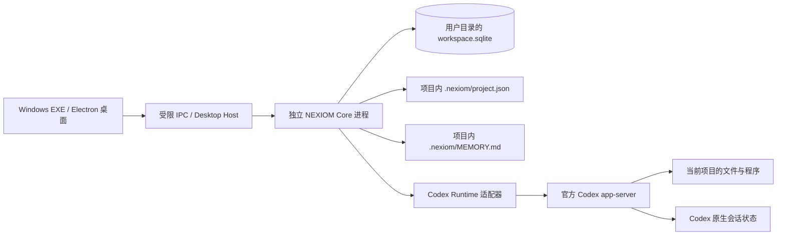

# NEXIOM 的项目级 Agent 定位与实现边界

核查日期：2026-09-19。依据当前源码与桌面实现；下文明确区分当前能力与下一阶段设计。本次没有导入或运行 Hermes 源码。

NEXIOM 的产品目标是**面向数学建模项目的 Agent 工作台**。`NEXIOM.exe` 是 Windows 桌面发行入口，负责启动窗口和本地核心；EXE 这种发行形式与项目级 Agent 并不冲突。当前已经有真实执行内核、工作目录、持久会话、项目记忆，以及可随工作文件夹恢复的项目本地记录，但仍缺少独立任务、实验与扩展管理等完整项目工具能力。前端做成桌面窗口不能替代这些能力。

## 1. 已实现的系统，而非界面上的功能名称

| 能力 | 源码证据 | 当前边界 |
| --- | --- | --- |
| 桌面入口与核心分离 | `apps/desktop/main.ts` 用 `utilityProcess.fork` 启动 Core；Renderer 通过 preload 调用验证后的命令 | Core 独立于渲染进程，但生命周期仍由桌面宿主管理；关闭应用会停止任务，不是常驻后台服务 |
| 真实 Agent 执行 | `packages/runtime/app-server.ts` 启动官方原生 `codex app-server --listen stdio://`，调用 `thread/start`、`thread/resume`、`turn/start` | 模型循环、文件与命令工具、原生上下文维护交给 Codex；NEXIOM 没有另写第二套推理循环 |
| 项目工作目录 | `packages/core/service.ts` 打开用户选择的真实目录，`packages/core/agent.ts` 取项目 `root` 作为每次执行的 `cwd` | 单项目同时只允许一个活动 Run；工作目录不是实验版本库，也不自动冻结输入文件 |
| 任务执行边界 | `agent.submit` 要求执行模式携带本次确认，运行时映射为 `read-only` 或 `workspace-write` | 目前是按次确认；还没有版本化计划审批、逐工具审批和任意权限升级的交互 |
| 持久会话与实际执行记录 | SQLite 保存当前应用索引与运行时绑定；`.nexiom/project.json` 同步保存项目、Thread、Message、Run、AgentItem 和上下文等项目记录 | 应用重启可以续接；重新选择工作文件夹可恢复 NEXIOM 历史，但不恢复 Codex 原生 thread ID；尚无独立 Task 实体和任务依赖 |
| 项目记忆 | `packages/core/memory.ts` 读写 `.nexiom/MEMORY.md`，SHA-256 冲突检查及原子保存；每次提交重新注入 | 用户维护的文本记忆；还没有自动事实抽取、来源索引、过期判断和跨会话检索 |
| 原生上下文机制 | Runtime 接收真实文本增量、token 统计及压缩通知 | 自动压缩由 Codex 决定；上次 token 用量不等于精确实时上下文占用率；尚无手动压缩入口 |
| 取消与恢复 | Coordinator 管理 AbortController；Runtime 结束本轮进程树；Core 重启将遗留运行标为中断 | 停止不回滚已经写出的文件，重启不自动重放有副作用的任务 |

运行时当前固定为 Codex 0.154.0，由 NEXIOM 独立保存并注入兼容 Responses API 的供应商配置，不读取个人 Codex 登录、配置或会话。Claude Code、Hermes 和 OpenCode 均不是当前运行内核。原生能力通过适配器暴露，并不代表 NEXIOM 已提供它们的所有配置、工具和交互入口。

## 2. 项目与应用状态目前放在哪里

| 状态 | 当前权威位置 | 迁移含义 |
| --- | --- | --- |
| 代码、数据、图表等工作文件 | 创建或打开的项目目录 | 可以用外部编辑器和文件管理器继续使用 |
| 项目记忆 | `<project>/.nexiom/MEMORY.md` | 随项目文件复制；它是用户维护的长期信息，不等同于聊天历史 |
| 项目、会话与执行记录 | `<project>/.nexiom/project.json` | 原子保存项目标识与名称，以及问题、会话、消息、请求、运行、事件、Agent 条目和上下文；重新选择该目录可恢复这些 NEXIOM 记录 |
| 当前应用索引与运行时绑定 | Electron 用户目录下的 `workspace/workspace.sqlite` | 用于当前安装的项目列表、设置及运行时关联；从 NEXIOM 移除项目会清除对应索引，但保留项目目录中的 `project.json`，重新选择即可导入恢复 |
| Codex 原生推理线程 | Codex 自己管理的会话存储；NEXIOM 的原生 thread ID 绑定只保存在当前应用数据库 | `project.json` 不包含 `agent_threads` 绑定；迁移或移除后重新选择可读取 NEXIOM 对话和运行历史，但下一次执行会建立新的原生线程 |
| 应用外观与连接凭证 | 应用用户目录；桌面密钥使用系统加密 | 不应跟随竞赛项目导出 |

默认桌面数据属于 Electron 的 `userData`；可用 `NEXIOM_USER_DATA_DIR` 指定独立测试目录。浏览器开发入口的 Core 使用 `.local/browser` 或指定的开发目录，数据与桌面独立。不同窗口看到不同项目时，首先检查入口和数据位置。

项目记录不会写入账户、模型供应商、API Key 或 Codex 原生 thread ID 绑定。它能恢复 NEXIOM 中可审阅的对话、运行和上下文记录，不承诺在另一台机器上续接同一个底层模型线程。项目 ID 与记录格式带版本，项目改名会同步到记录；项目目录移动后，在原位置不再存在时可以重新关联。

早期 [系统架构提案](02-system-architecture.md) 中的每项目 `.nexiom/state.sqlite` 和对象存储仍是目标设计，**尚未按该布局实现**；现行实现使用 `.nexiom/project.json` 作为项目本地记录。当前事实以本节和源码为准。

## 3. 从 Hermes 学什么

通过 AnySearch 检索后读取 [NousResearch/hermes-agent](https://github.com/NousResearch/hermes-agent)、[官方架构](https://hermes-agent.nousresearch.com/docs/developer-guide/architecture)、[记忆文档](https://hermes-agent.nousresearch.com/docs/user-guide/features/memory) 和 [MIT 许可证](https://raw.githubusercontent.com/NousResearch/hermes-agent/main/LICENSE)。在线文档会更新，这里记录的是访问当日的架构特征，不以功能数量或宣传用语作能力保证。

Hermes 官方架构将 CLI、Gateway、ACP、批处理和 API 等入口接到同一个 AIAgent；工具通过注册表与执行后端分离；会话存储支持 SQLite/FTS5；记忆、上下文引擎、插件和后台任务有独立模块。它证明成熟 Agent 的重点是可复用的执行与状态层，桌面只是其中一种入口。

| Hermes 的设计 | NEXIOM 的采用方向 | 不能直接等同的部分 |
| --- | --- | --- |
| 多入口共用同一 Agent | 保留 Core/Runtime 边界；后续命令行与桌面共用任务、权限及状态协议 | 当前没有面向用户的 `nexiom` CLI、ACP 或可独立启动的服务 |
| 记忆与历史检索分开 | 稳定事实留在有来源的项目记忆，历史会话按需搜索；会话内压缩继续交给执行引擎 | `MEMORY.md` 并不等于向量库或自动学习；当前 NEXIOM 记忆由用户维护 |
| 技能、工具与运行环境可扩展 | 用显式能力声明、依赖检测和启停配置管理数模技能、MCP、计算环境 | 当前能够显示部分原生 MCP 工具事件，尚无完整扩展管理器或授权交互 |
| 后台任务有独立进程和会话路由 | 长实验最终需要明确的服务生命周期、断线重连、取消和恢复协议 | 目前关窗口会停任务，不能宣称支持无人值守的 cron 或云端执行 |
| 经验可沉淀为技能 | 经过验证的清洗、求解、绘图和论文检查流程可以形成版本化技能 | 自动生成技能不代表方法经过统计或数学验证；必须绑定实际实验和验收结果 |

Hermes 以通用个人 Agent 和多入口协作为主。NEXIOM 的首要价值是赛题、模型、实验、证据和论文之间的可追溯关系。继续采用 Codex 做实际执行基座，同时吸收 Hermes 的模块化和持久化设计；本阶段没有理由叠加第二套工具循环。

## 4. 当前最需要补齐的能力

以下是产品级缺口，不是今天已交付的功能清单。

| 优先级 | 模块与具体交付 | 验收结果 |
| --- | --- | --- |
| P0 | 启动可靠性：普通快捷方式启动、可见加载/错误状态、诊断日志、恢复入口；设置成为完整页面 | 在实际用户目录和隔离目录均能启动；故障显示原因，不能只剩黑屏；设置返回保留原会话和草稿 |
| P1 | 项目状态与迁移加固：在现有稳定 project ID、版本化 `project.json`、目录重绑定和自动恢复基础上，补充显式导出/导入、备份、版本迁移与冲突诊断；原生线程不能恢复时生成可审阅交接摘要 | 项目换位置/换机器后代码、记忆及 NEXIOM 历史仍对应；明确区分恢复 NEXIOM 记录与新建原生线程交接 |
| P1 | 独立任务模型：`Task`、`PlanRevision`、`Approval`、状态与验收条件；Run 关联 Task | 新会话仍能继续同一任务；修改已批准计划产生新版本；Run 成功不能自动宣告研究任务验收通过 |
| P1 | 受支持的命令行入口与协议：项目打开、提交任务、查看状态、取消和诊断 | 桌面与 CLI 对同一项目使用同一任务状态和写入仲裁；CLI 不绕过确认与范围检查 |
| P2 | 科学计算环境与实验模块：环境清单、依赖锁、固定数据/代码快照、参数、随机种子、退出码和指标 | 一个实验可以在固定环境重跑；能比较同一评价协议下的两个方案；失败实验保留但不进入有效结果 |
| P2 | 记忆与技能管理：项目历史全文检索、带来源的记忆候选、人工确认、版本及撤销；技能依赖与适用条件 | 新会话能定位事实来源；错误记忆可修正；技能不能自行授予权限或宣称未运行结果 |
| P2 | 扩展管理：原生 MCP 配置与状态、按能力审批、模型/工具环境诊断 | 未安装/未授权工具明确不可用；中断与权限事件能完整映射到桌面及 CLI |
| P3 | 证据与论文：数据版本 → 实验 → 指标/产物 → 论断 → 论文块 → 导出清单 | 论文关键数值能定位真实运行；输入变化后依赖检查过期；PDF/DOCX 导出有版面验证 |
| 后续 | 独立后台服务、实验队列与资源预算，再考虑团队/远程入口 | 关闭前端后的行为可配置且可验证；重新连接有事件游标；取消、重启和并发不会重复执行 |

P0 修复是本轮工作范围；后续条目是实施顺序与验收边界，不表示已经开始运行后台服务、远程连接或新增引擎。多模型、更多工具、更多动画都不能代替项目数据模型和实验复现。

## 5. 下一阶段最小闭环

继续沿用 [核心数据结构](04-domain-model.md) 中的实体关系，但先实现足以完成一个真实赛题小问的闭环：

1. 打开包含原始数据的项目，保存赛题问题及待确认假设。
2. 建立独立 Task 与带验收条件的 PlanRevision；确认后创建 Run。
3. 固定输入、代码、环境、参数和评价协议，登记 Experiment 并实际运行。
4. 从结果文件读取 Metric 与 Artifact，验证完成后关联具体论断。
5. 重启或创建新会话，能继续该任务并查明所用版本；导出一个包含重跑说明的项目包。

这条闭环完成后，再增加大规模并行、自动学习和远程渠道。NEXIOM 应以可复现的项目成果证明它是项目级 Agent 工具。
